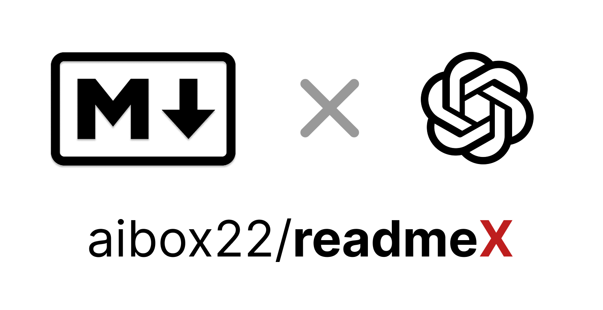
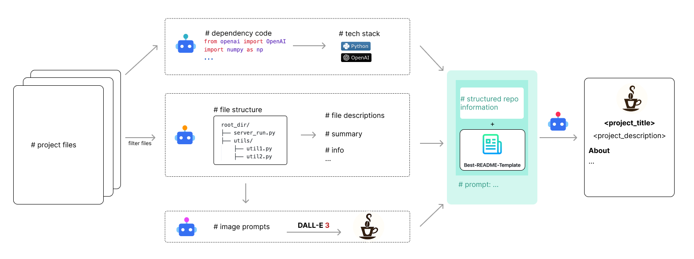

<a id="readme-top"></a>

<!-- 语言切换 -->
<div align="center">
  
[English](README.md) | 简体中文

</div>

<!-- 新增项目海报 -->
<div align="center">
  
</div>

---

<!-- 项目LOGO -->
<br />
<div align="center">
  <!-- <a href="https://github.com/aibox22/readmex">
    
  </a> -->

<h3 align="center">readmex</h3>

  <p align="center">
    🚀 AI智能README生成器：自动创建Markdown文档、Logo、徽章等。再也不用为文档编写而烦恼！
    <br />
    <a href="https://github.com/aibox22/readmex"><strong>探索文档 »</strong></a>
    <br />
  </p>

  <!-- 项目徽章 -->
[![贡献者][contributors-shield]][contributors-url]
[![分支][forks-shield]][forks-url]
[![星标][stars-shield]][stars-url]
[![问题][issues-shield]][issues-url]
<!-- [![最新版本][release-shield]][release-url]
![发布日期][release-date-shield] -->
[![许可证][license-shield]][license-url]

  <p align="center">
    <a href="https://github.com/aibox22/readmex">查看演示</a>
    &middot;
    <a href="https://github.com/aibox22/readmex/issues/new?labels=bug&template=bug-report---.md">报告Bug</a>
    &middot;
    <a href="https://github.com/aibox22/readmex/issues/new?labels=enhancement&template=feature-request---.md">请求功能</a>
  </p>
</div>

<!-- 目录 -->
<details>
  <summary>目录</summary>
  <ol>
    <li>
      <a href="#关于项目">关于项目</a>
      <ul>
        <li><a href="#技术栈">技术栈</a></li>
      </ul>
    </li>
    <li>
      <a href="#快速开始">快速开始</a>
      <ul>
        <li><a href="#前置要求">前置要求</a></li>
        <li><a href="#安装">安装</a></li>
      </ul>
    </li>
    <li><a href="#使用方法">使用方法</a></li>
    <li><a href="#路线图">路线图</a></li>
    <li><a href="#贡献">贡献</a></li>
    <li><a href="#许可证">许可证</a></li>
    <li><a href="#联系方式">联系方式</a></li>
    <li><a href="#致谢">致谢</a></li>
  </ol>
</details>

<!-- 关于项目 -->
## 关于项目

[](https://example.com)

AI智能README生成器是一个基于AI的工具，可以自动为您的项目生成全面的Markdown README文件。它能够生成结构良好的文档，包括项目详情、技术栈、设置说明、使用示例、徽章、Logo等。

### 核心功能

- 🤖 **AI驱动的README生成**：即时生成全面的Markdown README文档
- 🔗 **自动徽章生成**：创建并嵌入相关的状态徽章（贡献者、分支、星标等）
- 🖼️ **智能Logo设计**：自动生成独特的项目Logo
- 🧠 **技术栈识别**：自动检测并包含项目的技术栈
- 🌐 **上下文感知智能**：根据项目的特定上下文和需求定制内容

<p align="right">(<a href="#readme-top">返回顶部</a>)</p>

### 技术栈

- [![Python][Python]][Python-url]
- [![OpenAI][OpenAI]][OpenAI-url]
- [![Rich][Rich]][Rich-url]

<p align="right">(<a href="#readme-top">返回顶部</a>)</p>

<!-- 快速开始 -->
## 快速开始

以下是在本地设置项目的示例说明。要获取本地副本并运行，请按照以下简单步骤操作。

### 前置要求

- Python 3.7+

### 安装

1. 使用 pip 安装软件包：
   ```bash
   pip install readmex
   ```

### 配置

`readmex` 需要语言模型（用于生成文本）和文生图模型（用于生成Logo）的API密钥。您可以通过以下两种方式之一进行配置。环境变量的优先级更高。个人信息也可以在全局文件中设置，以作为交互式会话期间的默认值。

#### 1. 环境变量 (推荐在CI/CD环境中使用)

在您的 shell 中设置以下环境变量：

```bash
export LLM_API_KEY="your_llm_api_key"       # 必填
export T2I_API_KEY="your_t2i_api_key"       # 必填

# 可选：指定自定义API端点和模型
export LLM_BASE_URL="https://api.example.com/v1"
export T2I_BASE_URL="https://api.example.com/v1"
export LLM_MODEL_NAME="your-llm-model"
export T2I_MODEL_NAME="your-t2i-model"

# 可选：RAG（检索增强生成）的嵌入模型配置
export EMBEDDING_API_KEY="your_embedding_api_key"     # 可选，用于Web嵌入模型
export EMBEDDING_BASE_URL="https://api.example.com/v1" # 可选，用于Web嵌入模型
export EMBEDDING_MODEL_NAME="text-embedding-3-small"   # 可选，嵌入模型名称
export LOCAL_EMBEDDING="true"                         # 可选，使用本地嵌入模型（默认：true）
```

#### 2. 全局配置文件 (推荐在本地使用)

为了方便，您可以创建一个全局配置文件，工具会自动查找它。

1.  创建目录：`mkdir -p ~/.readmex`
2.  创建配置文件：`~/.readmex/config.json`
3.  添加您的凭据和任何可选设置：

```json
{
  "LLM_API_KEY": "在此处填入您的LLM API密钥",
  "T2I_API_KEY": "在此处填入您的T2I API密钥",
  "LLM_BASE_URL": "https://api.example.com/v1",
  "T2I_BASE_URL": "https://api.example.com/v1",
  "LLM_MODEL_NAME": "your-llm-model",
  "T2I_MODEL_NAME": "your-t2i-model",
  "EMBEDDING_API_KEY": "您的嵌入模型API密钥",
  "EMBEDDING_BASE_URL": "https://api.example.com/v1",
  "EMBEDDING_MODEL_NAME": "text-embedding-3-small",
  "LOCAL_EMBEDDING": "true",
  "github_username": "您的GitHub用户名",
  "twitter_handle": "您的Twitter用户名",
  "linkedin_username": "您的LinkedIn用户名",
  "email": "您的电子邮箱"
}
```

<p align="right">(<a href="#readme-top">返回顶部</a>)</p>

<!-- 使用示例 -->
## 使用方法

有三种方式运行 `readmex` 工具：

### 方法 1：安装后直接使用（推荐）

安装完成后，您可以在命令行中直接使用 `readmex` 命令：
```bash
readmex
```

### 方法 2：作为 Python 模块运行

如果您没有安装包或想要使用开发版本：
```bash
# 使用简化的模块调用
python -m readmex

# 或者使用完整的模块路径
python -m readmex.utils.cli
```

### 方法 3：开发者模式（直接运行脚本）

对于开发者或想要直接运行源代码：
```bash
python src/readmex/utils/cli.py
```

### 命令行选项

所有运行方式都支持以下选项：
```bash
# 基本用法
readmex

# 指定项目路径和输出目录
readmex --project-path /path/to/your/project --output-dir /path/to/output

# 生成网站
readmex --website

# 启动本地服务器
readmex --serve

# 部署到 GitHub Pages
readmex --deploy

# 查看帮助
readmex --help
```

这将会：
1. 生成`project_structure.txt`文件，包含项目结构
2. 生成`script_description.json`文件，包含项目中脚本的描述
3. 生成`requirements.txt`文件，包含项目的依赖要求
4. 生成`logo.png`文件，包含项目的Logo
5. 生成`README.md`文件，包含项目的README文档

<p align="right">(<a href="#readme-top">返回顶部</a>)</p>

<!-- 路线图 -->
## 路线图

- [ ] Logo生成的提示工程优化
- [ ] 多语言支持
- [ ] 增强AI对项目功能的描述能力

查看[开放问题](https://github.com/aibox22/readmex/issues)以获取提议功能（和已知问题）的完整列表。

<p align="right">(<a href="#readme-top">返回顶部</a>)</p>

<!-- 贡献 -->
## 贡献

贡献让开源社区成为了一个学习、启发和创造的绝佳场所。您所做的任何贡献都是**非常感谢**的。

如果您有建议可以改善此项目，请fork该仓库并创建一个pull request。您也可以简单地创建一个带有"enhancement"标签的issue。
不要忘记给项目点个星！再次感谢！

1. Fork此项目
2. 创建您的功能分支 (`git checkout -b feature/AmazingFeature`)
3. 提交您的更改 (`git commit -m 'Add some AmazingFeature'`)
4. 推送到分支 (`git push origin feature/AmazingFeature`)
5. 开启一个Pull Request

<p align="right">(<a href="#readme-top">返回顶部</a>)</p>

### 主要贡献者：

<a href="https://github.com/aibox22/readmex/graphs/contributors">
  
</a>

<!-- 许可证 -->
## 🎗 许可证

版权所有 © 2024-2025 [readmex][readmex]。<br />
基于[MIT][license-url]许可证发布。

<p align="right">(<a href="#readme-top">返回顶部</a>)</p>

<!-- 联系方式 -->
## 联系方式

邮箱：lintaothu@foxmail.com

项目链接：[https://github.com/aibox22/readmex](https://github.com/aibox22/readmex)

QQ群：2161023585（欢迎加入我们的QQ群进行讨论和获取帮助！）

<p align="right">(<a href="#readme-top">返回顶部</a>)</p>

<!-- 参考链接 -->
[readmex]: https://github.com/aibox22/readmex

<!-- MARKDOWN链接和图片 -->
[contributors-shield]: https://img.shields.io/github/contributors/aibox22/readmex.svg?style=flat-round
[contributors-url]: https://github.com/aibox22/readmex/graphs/contributors
[forks-shield]: https://img.shields.io/github/forks/aibox22/readmex.svg?style=flat-round
[forks-url]: https://github.com/aibox22/readmex/network/members
[stars-shield]: https://img.shields.io/github/stars/aibox22/readmex.svg?style=flat-round
[stars-url]: https://github.com/aibox22/readmex/stargazers
[issues-shield]: https://img.shields.io/github/issues/aibox22/readmex.svg?style=flat-round
[issues-url]: https://github.com/aibox22/readmex/issues
[release-shield]: https://img.shields.io/github/v/release/aibox22/readmex?style=flat-round
[release-url]: https://github.com/aibox22/readmex/releases
[release-date-shield]: https://img.shields.io/github/release-date/aibox22/readmex?color=9cf&style=flat-round
[license-shield]: https://img.shields.io/github/license/aibox22/readmex.svg?style=flat-round
[license-url]: https://github.com/aibox22/readmex/blob/master/LICENSE.txt
[Python]: https://img.shields.io/badge/Python-3776AB?style=flat-round&logo=python&logoColor=white
[Python-url]: https://www.python.org/
[OpenAI]: https://img.shields.io/badge/OpenAI-000000?style=flat-round&logo=openai&logoColor=white
[OpenAI-url]: https://openai.com/
[Flask]: https://img.shields.io/badge/Flask-000000?style=flat-round&logo=flask&logoColor=white
[Flask-url]: https://flask.palletsprojects.com/
[Rich]: https://img.shields.io/badge/Rich-000000?style=flat-round&logo=rich&logoColor=white
[Rich-url]: https://rich.readthedocs.io/